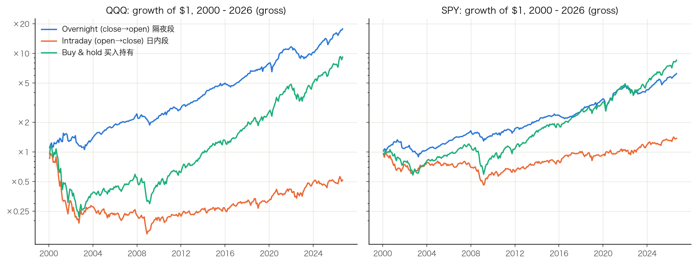

# 美股「隔夜效应」分析 · US Overnight Return Effect

> 把 SPY(标普 500)与 QQQ(纳指 100)每个交易日的收益拆成**隔夜段**(前收盘 → 次日开盘)和**日内段**(开盘 → 收盘),用 2000–2026 年共 6,693 个交易日检验:美股的收益到底发生在什么时候?

📊 **[点这里看完整交互式报告](https://xinc313.github.io/overnight-effect-analysis/)**(可切换 SPY/QQQ、悬停查看数值)



## 核心发现

| 指标(2000–2026,未计成本) | QQQ 隔夜段 | QQQ 日内段 | SPY 隔夜段 | SPY 日内段 |
|---|---|---|---|---|
| 年化收益 | **+11.4%** | −2.5% | **+7.1%** | +1.2% |
| t 统计量 | 4.29 | 0.03 | 3.46 | 0.79 |
| 单日胜率 | 55.6% | 52.5% | 55.2% | 53.1% |
| 夏普比率 | 0.83 | 0.01 | 0.67 | 0.15 |
| 最大回撤 | −33.5% | −86.7% | −32.8% | −57.0% |

1. **过去 26 年,QQQ 的全部长期收益都发生在隔夜段**;日内段在统计上与零无异(SPY 亦然)。这是学术文献中著名的 *overnight return effect*(Cliff, Cooper & Gulen 2008;Lou, Polk & Skouras 2019)。
2. **隔夜段收益更高、波动更低**:日波动只有日内段的 60–70%,熊市暴跌主要发生在日内。
3. **但「纯隔夜」策略对成本极度敏感**:每天收盘买、开盘卖,单边成本超过约 1.5–2 个基点(点差+滑点+佣金),优势即被完全吞噬——这正是该效应长期存在而未被套利消灭的原因。
4. 2020 年以来日内段收益明显回升,隔夜/日内差距在收窄。
5. **条件化分析(报告第二个标签页)**:隔夜效应本质是均值回归——**前一夜隔夜下跌后**,下一晚隔夜显著更强(QQQ 日均 +9.1bp、t=5.14;上涨后仅 +1.1bp、t=0.83),该规律在两个标的 × 前后半样本中全部 t>3。只在前夜下跌后持隔夜,每年交易约 112 晚(44%)即可捕获 90% 以上的隔夜收益,最大回撤从 −33% 降至 −18%,成本盈亏平衡点放宽到约 3–4bp/边。
6. **策略变体与仓位优化(第四个标签页)**:「买入后又跌」的仓位回答——连跌加仓 1x/1.5x/2x(S2)样本外(2016–2026)年化 +9.0% vs 基准 +5.6%;波动率目标仓位(S3)夏普最高(0.88)、回撤最小(−16%);两者组合 S5 样本外夏普 0.75 为全部变体最优。深跌进场门槛与剔除长连跌均被样本外否决。加仓的代价:最坏单夜 −16.7%(2x 仓撞 −8.4% 跳空)。

## 最终模型(第四个标签页):三代模型与生产组合

- **Ⅰ 固定规则**(押均值回归):前夜跌+非周一,连跌加仓×波动率刹车,2008–26 夏普 1.05,但 2025–26 因均值回归转为动量而连续亏损。
- **Ⅱ 自适应规则**(不押注):哪个桶(跌后/涨后)最近 126 夜赚钱就做哪个,近 3 年夏普 1.10。
- **Ⅲ GBM 机器学习**:11 个因子(含当日日内)喂给梯度提升树,逐年重训、全程样本外,近 3 年夏普 1.45、近 1 年 +21.0%(1.83);特征重要性前两名(近5日收益、昨夜隔夜)与手工结论一致,日内因子在非线性交互中贡献 8.6%。
- **96 组合网格搜索背书**:训练段(2000–15)与样本外(2016–26)冠亚军都是手工固定模型——信号层已到顶。
- **正式形态 = 固定模型**(全样本夏普 1.15 / 样本外 1.06,穷举最优、规则透明):这是押「均值回归会回来」的选择,2025–26 连续亏损背景下,失效红线为强制项(滚动 3 年夏普<0 或信号夜胜率<50% 即切换到留档的 50/50 组合或 GBM;当前滚动 3 年夏普 0.19,26 年最低,黄灯已亮)。生产组合(固定50%+GBM50%,全窗口夏普 0.80–1.07)与 GBM 单腿作为切换预案留档。

## 复现方法

```bash
python -m venv venv && source venv/bin/activate
pip install -r requirements.txt
python scripts/fetch_data.py        # 从 Yahoo Finance 下载 SPY/QQQ 日频数据到 data/
python scripts/analyze.py           # 隔夜/日内收益拆解 + 统计检验
python scripts/backtest.py          # 纯隔夜策略的成本敏感性回测
python scripts/export_chartdata.py  # 导出报告页面用的图表数据
python scripts/conditional.py       # 条件化分析: 什么条件下隔夜更强
python scripts/export_cond.py       # 条件策略回测 + 导出第二个标签页数据
python scripts/tqqq_streak.py       # TQQQ、连跌分组与退出政策回测
python scripts/export_tab3.py       # 导出第三个标签页数据
python scripts/strategies.py        # 策略变体(加仓/波动率目标)+ 样本外检验
python scripts/factors.py           # 附加因子: VIX/星期几/财报季 胜率地图
python scripts/export_tab4.py       # 导出第四个标签页数据
python scripts/final_model.py       # 固定模型整体回测
python scripts/gridsearch.py        # 96 因子组合网格搜索(训练/样本外)
python scripts/ml_model.py          # walk-forward GBM/逻辑回归
python scripts/export_final2.py     # 生产组合(固定+GBM)回测与导出
```

- 隔夜收益 = 当日开盘价 / 前日收盘价 − 1;日内收益 = 当日收盘价 / 当日开盘价 − 1
- 使用分红再投资的复权价;年化为复利口径;t 检验为对「日均收益 = 0」的单样本检验

## ⚠️ 免责声明

本仓库仅为历史数据的统计描述与研究探讨,**不构成任何投资建议**。历史表现不预示未来结果;频繁交易还涉及税务(短期资本利得)、PDT 规则与隔夜跳空风险(样本内最差单日 −10.5%,无法止损)。任何投资决策请咨询持牌专业人士并自行承担风险。
